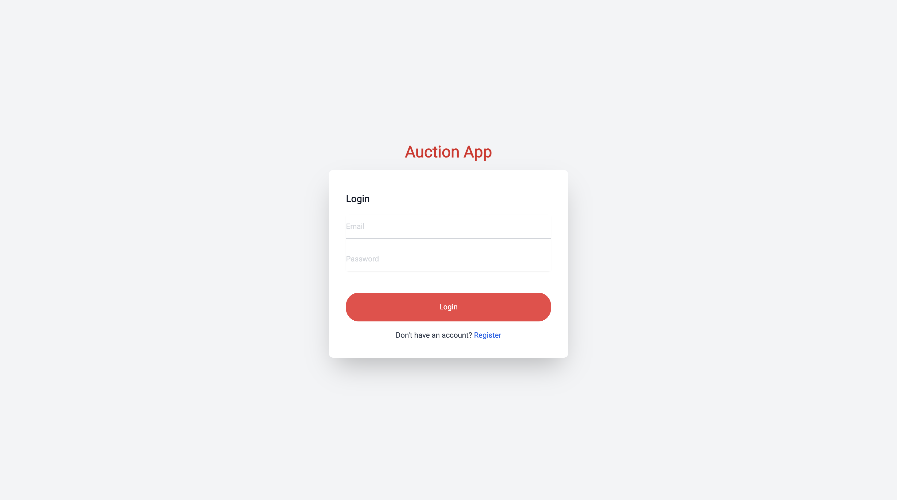
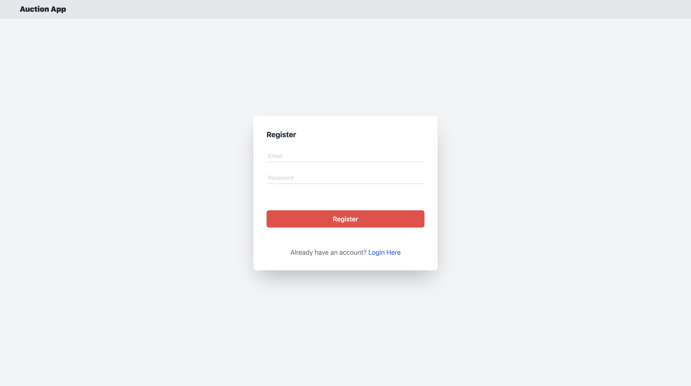

# Auction App

## Getting Started

### Description  

This is a simple auction app that allows users to create auctions and bid on them, the users can register and login to the app, and they can deposit their money to their account and use it to bid on the auctions. 

### Technologies

To build this app I used the following technologies:
- [NextJS](https://nextjs.org/) is a framework that builds on top of ReactJS, and it's used to build server-side rendered applications, it can be used to build fullstack applications.
- [TypeScript](https://www.typescriptlang.org/) is a superset of JavaScript that adds types to the language, it's used to build large scale applications.
- [TailwindCSS](https://tailwindcss.com/) is a utility-first CSS framework that allows you to build custom designs without leaving your HTML.
- [Prisma](https://www.prisma.io/) is an ORM that allows you to interact with your database using a type-safe API.
- [SQLite](https://www.sqlite.org/) is a C-language library that implements a small, fast, self-contained, high-reliability, full-featured, SQL database engine.
- [Docker](https://www.docker.com/) is a tool that allows you to create containers for your applications, it's used to create the development environment for the application.
- [GitHub](https://github.com) is a code hosting platform for version control and collaboration. It lets you and others work together on projects from anywhere.

### Installation

To before you Install  the application you have to make sure that you already have : 

- [NodeJS](https://nodejs.org/en/) is a JavaScript runtime built on Chrome's V8 JavaScript engine.
- [Yarn](https://yarnpkg.com/) is a package manager for your code. It allows you to use and share code with other developers from around the world. or you can use [NPM](https://www.npmjs.com/) which is the default package manager for NodeJS.
- [Docker](https://www.docker.com/) installed on your machine. 

if you have all of the above installed on your machine you can follow the following steps to install the application:

- Clone the repository to your machine using the following command:

```bash
git clone https://github.com/ivandi1980/auction-app.git
```

- Navigate to the project directory:

```bash
cd auction-app
```

- Install the dependencies:

```bash
yarn install
# or
npm install
```

### Running the application

There are 2 ways to run the application:
- Using [Docker](https://www.docker.com/)
- Using Standard [NextJS](https://nextjs.org/) commands

#### Using Docker
if you choose to run this App using Docker you have to make sure that you have Docker installed on your machine, then you can run the following command to start the application:

```bash
docker-compose up
```
and next step is openning the browser and navigate to http://localhost:8000


#### Using Standard NextJS commands  

if you choose to run this App using Standard NextJS commands you have to make sure that you have NodeJS installed on your machine, then you can run the following command to start the application:

```bash
cd auction-app
```

```bash
yarn dev
```
and next step is openning the browser and navigate to http://localhost:8000


### Usage

To use the application you have to `register` first, then you can `log in` to the application and start creating auctions and bidding on them.

### Screenshot  

- Login Page  



- Register Page  




### Contribute
[ivandjoh](https://linkedin.com/in/ivandjoh)


